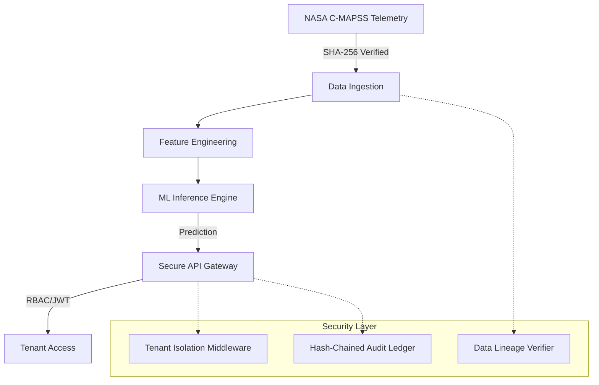

# PulseNet RUL Forecasting

[](https://github.com/poojakira/PulseNet-RUL-Forecasting/actions/workflows/ci.yml)


PulseNet is a production-grade, evidence-driven predictive maintenance platform for NASA C-MAPSS turbofan telemetry. It serves as a flagship demonstration of **Secure ML Engineering**, focusing on data integrity, tenant isolation, and verifiable audit trails in safety-critical contexts.

## 🚀 Problem Statement

Turbofan Remaining Useful Life (RUL) prediction is critical for aviation safety. However, ML models in these environments are vulnerable to **telemetry tampering**, **unauthorized model rollbacks**, and **tenant data leakage**. PulseNet addresses these risks by wrapping a high-performance RUL forecaster in a zero-trust security architecture.

## 🏗️ Architecture



## 🛡️ Security Features

- **Auth & RBAC**: Granular permissions for `training`, `prediction`, `audit`, and `verification` via JWT.
- **Tenant Isolation**: Strict `X-Tenant-ID` propagation and isolation at the middleware level.
- **Audit Integrity**: All prediction and lifecycle events are logged to a SHA-256 hash-chained ledger, preventing retrospective tampering.
- **Data Lineage**: Automated verification of the NASA C-MAPSS dataset (SHA-256: `74bef...a34f`) ensuring zero synthetic-data contamination.
- **Hardened Deployment**: Non-root Docker runtime, minimal base image, and strictly externalized secrets.

## 📊 Evidence & Verification

PulseNet is backed by empirical evidence committed to the repository:

- **Official Data**: Uses NASA C-MAPSS FD001. No synthetic fixtures.
- **Verification Script**: `python verify.py` performs an end-to-end integrity check.
- **Measured Results**: `docs/evidence/validation_results.json` contains the latest model performance benchmarks.
- **Lineage Docs**: Full traceability in `docs/DATA_LINEAGE.md`.

## 🛠️ Quick Start

### Installation

```bash
# Clone and install dependencies
git clone https://github.com/poojakira/PulseNet-RUL-Forecasting.git
cd PulseNet-RUL-Forecasting
python -m pip install -r requirements.txt
```

### Run Integrity Verification

```bash
# Verifies data lineage, auth boundaries, and model hashes
python verify.py
```

### Start Secure API

```bash
# Starts the FastAPI server with security middleware enabled
uvicorn src.pulsenet.api:app --reload
```

## 🧪 CI/CD Gates

The pipeline enforces a "Zero Trust" build process:
- **Security Scans**: `bandit` for static analysis and `pip-audit` for dependency vulnerabilities.
- **Integrity Checks**: Automated execution of `verify.py` against official data.
- **Type Safety**: `pyright` for strict type checking.
- **Quality**: `ruff` for linting and formatting.

## 📜 Documentation

- [SECURITY.md](./SECURITY.md) - Disclosure policy and security focus.
- [THREAT_MODEL.md](./THREAT_MODEL.md) - Assets, adversaries, and mitigations.
- [IR_PLAYBOOK.md](./IR_PLAYBOOK.md) - Incident response procedures for ML compromise.

---
**Status**: Active Flagship Project. Optimized for security-first ML production environments.
