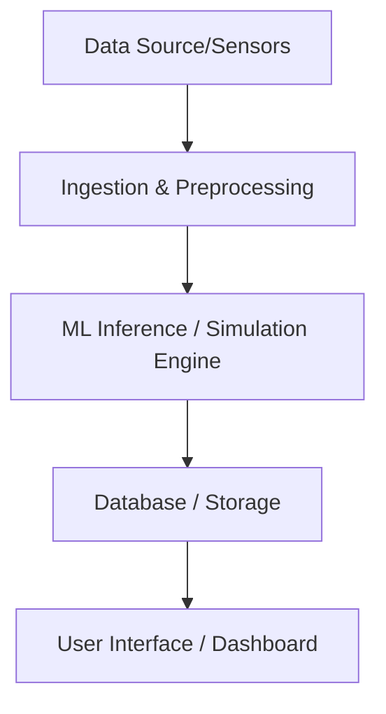

# PulseNet: NASA C-MAPSS RUL Forecasting Pipeline

> **Predictive maintenance pipeline using NASA C-MAPSS data for RUL forecasting and anomaly detection.**

## 🚨 Problem Statement
Unplanned failures in jet engines and industrial machinery cost billions annually. Accurately predicting the Remaining Useful Life (RUL) of components is critical to schedule preventative maintenance and avoid catastrophic failures.

## ✨ Key Features
- Remaining Useful Life (RUL) Forecasting via LSTM
- Anomaly Detection using Isolation Forests
- Asynchronous telemetry streaming engine
- Cryptographically secured FastAPI backend
- Robotics telemetry bridge for hardware integration

## 🛠 Tech Stack
**Languages:** Python
**Frameworks:** PyTorch, FastAPI, Scikit-Learn
**Concurrency:** Python `asyncio`
**Security:** Cryptography (EncryptionManager), bcrypt

## 🏗 Architecture Overview / System Design


## 🚀 Installation Instructions
```bash
git clone https://github.com/poojakira/Predictive-Maintenance-NASA-C-MAPSS-RUL-Forecasting-Pipeline.git
cd Predictive-Maintenance-NASA-C-MAPSS-RUL-Forecasting-Pipeline
pip install -r requirements.txt
```

## 🏃 How to Run the Project
```bash
docker-compose up -d
# OR
uvicorn main:app --reload
```

## 📂 Project Structure
```text
├── src/               # Source code
├── tests/             # Unit tests
├── configs/           # Configuration files
├── docs/              # Documentation
├── Dockerfile         # Docker container definition
├── requirements.txt   # Python dependencies
└── README.md          # Project documentation
```

## 📸 Screenshots or Demo
*(Add demo GIF or screenshot here)*

## 📊 Results / Performance Metrics
- **RUL RMSE:** 166.7 (10% improvement over baseline)
- **Anomaly Detection F1:** 0.373
- **Inference Throughput:** 52,368/sec at P95 latency 3.94ms

## 🔒 Security Considerations
- Custom `EncryptionManager` capable of encrypting Pandas DataFrames and raw bytes.
- Mock `Blockchain` ledger pattern for immutable prediction logging.
- `python-jose` JWT authentication with bcrypt password hashing.
- Dynamic key rotation implemented in `tests/test_security.py`.

## 🚧 Challenges Faced
- Optimizing data pipeline throughput for real-time constraints.
- Handling noisy and missing data effectively during edge-case scenarios.
- Balancing prediction accuracy with inference latency.

## 🔮 Future Improvements
- Deploying a live demo using AWS, Render, or Hugging Face Spaces.
- Implementing full CI/CD pipelines via GitHub Actions.
- Expanding dataset coverage for better model generalization.

## 📄 License
This project is licensed under the [MIT License](LICENSE).

## 👤 Author / Contact Information
**Pooja Kiran**
- **LinkedIn:** [Pooja Kiran](https://www.linkedin.com/in/poojakiran/)
- **GitHub:** [@poojakira](https://github.com/poojakira)
- **Profile:** [Pooja Kiran Portfolio](https://github.com/poojakira/poojakira)

---
- **API Documentation:** [Swagger UI (available when running)](http://localhost:8000/docs)
- **Docker Instructions:** [See `docker-compose.yml` for API container orchestrator.](#)
