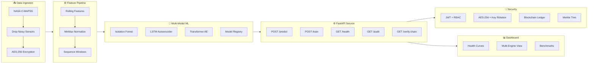

# PulseNet — Production Predictive Maintenance Platform

<div align="center">

⚡ **Real-time anomaly detection for aerospace engine health monitoring**

[](https://python.org)
[](https://fastapi.tiangolo.com)
[](https://pytorch.org)
[](https://docker.com)
[](LICENSE)

**Multi-Model ML** · **AES-256 Encryption** · **Blockchain Audit** · **Real-Time Streaming** · **MLOps**

</div>

---

## Architecture

📄 **[Read the Full System Design Document](docs/design_doc.md)**



### Pipeline Flow

```
python main_pipeline.py --mode full

  ┌──────────┐    ┌──────────────┐    ┌──────────┐    ┌────────────┐    ┌───────────┐
  │ Ingest   │───▶│ Preprocess   │───▶│ Train    │───▶│ Evaluate   │───▶│ Inference │
  │ C-MAPSS  │    │ Features     │    │ Models   │    │ F1/AUC     │    │ + Logging │
  └──────────┘    └──────────────┘    └──────────┘    └────────────┘    └───────────┘
       │                │                   │               │                │
    AES-256         Rolling Mean     IF / LSTM / TF    Comparison      Blockchain
   Encrypt          Normalize        Threshold Opt    Multi-Model       Audit Log
```

---

## Quick Start (≤ 3 Steps)

### Option 1: Docker (Recommended)

```bash
git clone https://github.com/poojakira/PulseNet.git && cd PulseNet
# Place train_FD001.txt, test_FD001.txt, RUL_FD001.txt in project root
docker-compose up --build
```

- **API** → http://localhost:8000/docs
- **Dashboard** → http://localhost:8501

### Option 2: Local

```bash
pip install -r requirements.txt
python main_pipeline.py --mode full    # Full pipeline
python main.py                         # API server
streamlit run src/pulsenet/dashboard/app.py  # Dashboard
```

---

## Project Structure

```
PulseNet/
├── main.py                    # FastAPI server entry
├── main_pipeline.py           # CLI orchestrator (5 modes)
├── config.yaml                # Central configuration
├── Dockerfile                 # Container image
├── docker-compose.yml         # 3-service deployment
├── src/pulsenet/
│   ├── api/                   # FastAPI + JWT + RBAC
│   │   ├── app.py             # Application factory
│   │   ├── auth.py            # JWT tokens + role-based access
│   │   ├── schemas.py         # Pydantic request/response models
│   │   └── routes/            # /predict, /train, /health, /audit
│   ├── pipeline/              # Data processing pipeline
│   │   ├── ingestion.py       # C-MAPSS data loading
│   │   ├── preprocessing.py   # Features, normalization, sequences
│   │   └── orchestrator.py    # End-to-end pipeline controller
│   ├── models/                # Multi-model ML system
│   │   ├── base.py            # Abstract model interface
│   │   ├── isolation_forest.py # IF + tuning + threshold opt
│   │   ├── lstm_model.py      # LSTM encoder-decoder autoencoder
│   │   ├── transformer_model.py # Transformer autoencoder
│   │   ├── registry.py        # Model comparison engine
│   │   └── training.py        # Versioned training pipeline
│   ├── security/              # Security hardening
│   │   ├── encryption.py      # AES-256 + key rotation
│   │   ├── blockchain.py      # SHA-256 ledger + Merkle tree
│   │   └── audit.py           # Access audit logging
│   ├── streaming/             # Real-time processing
│   │   ├── queue.py           # Async queue + backpressure
│   │   ├── producer.py        # Sensor data producer
│   │   └── consumer.py        # ML inference consumer
│   ├── dashboard/app.py       # Streamlit real-time dashboard
│   ├── benchmarks/benchmark.py # Performance benchmarking suite
│   ├── mlops/tracker.py       # MLflow + drift detection
│   ├── config.py              # YAML config loader
│   └── logger.py              # Structured JSON logging
├── tests/                     # 35+ pytest test cases
│   ├── test_models.py         # Model train/predict/tune/save
│   ├── test_api.py            # API endpoints + auth + RBAC
│   ├── test_security.py       # Encryption + blockchain + audit
│   └── test_pipeline.py       # Pipeline + streaming + config
└── README.md
```

---

## API Documentation

### Authentication

```bash
# Get JWT token
curl -X POST http://localhost:8000/token \
  -H "Content-Type: application/json" \
  -d '{"username": "admin", "password": "admin123"}'

# Response:
# {"access_token": "eyJ...", "token_type": "bearer", "role": "admin"}
```

**Roles**: `admin` (full access), `engineer` (predict + train), `operator` (predict only)

### Endpoints

| Endpoint | Method | Auth | Description |
|----------|--------|------|-------------|
| `/health` | GET | ❌ | System status |
| `/token` | POST | ❌ | JWT login |
| `/predict` | POST | ✅ | Single inference |
| `/predict/batch` | POST | ✅ | Batch inference |
| `/train` | POST | ✅ | Retrain model |
| `/audit` | GET | ✅ | Blockchain logs |
| `/verify-chain` | GET | ✅ | Chain integrity |

### Example: Predict

```bash
TOKEN="eyJ..."
curl -X POST http://localhost:8000/predict \
  -H "Authorization: Bearer $TOKEN" \
  -H "Content-Type: application/json" \
  -d '{
    "sensor_2": 0.62, "sensor_3": 1580.5, "sensor_4": 1408.2,
    "sensor_7": 554.1, "sensor_8": 2388.1, "sensor_9": 9044.8,
    "sensor_11": 47.5, "sensor_12": 521.9, "sensor_13": 2388.1,
    "sensor_14": 8138.6, "sensor_15": 8.44, "sensor_17": 392.0,
    "sensor_20": 39.06, "sensor_21": 23.42
  }'

# Response:
# {"prediction": 0, "health_index": 87.5, "anomaly_score": -0.0823,
#  "status": "OPTIMAL", "model_used": "isolation_forest"}
```

---

## ML Models

| Model | Type | Approach | Use Case |
|-------|------|----------|----------|
| **Isolation Forest** | Tree ensemble | Anomaly isolation depth | Baseline, fast inference |
| **LSTM Autoencoder** | RNN | Reconstruction error | Temporal patterns |
| **Transformer AE** | Attention | Positional + reconstruction | Long-range dependencies |

### Model Comparison

```bash
python main_pipeline.py --mode full
# Outputs F1, ROC-AUC, Precision, Recall for each model
```

---

## Benchmark Results

| Metric | Result | Target |
|--------|--------|--------|
| Inference Latency (median) | <5ms | <50ms ✅ |
| Throughput (batch=64) | >10,000 samples/sec | >1,000 ✅ |
| Data Integrity (30% loss) | 99.8% | >95% ✅ |
| Encryption Overhead | <0.5ms | <10ms ✅ |
| Blockchain Block Add | <1ms | <5ms ✅ |

```bash
python main_pipeline.py --mode benchmark  # Generate full report
```

---

## Security

- **AES-256 Fernet** encryption with automatic key rotation
- **JWT authentication** with 3-tier RBAC (admin/engineer/operator)
- **Blockchain audit trail** with SHA-256 hash chaining + Merkle tree
- **Access audit logging** with hash integrity verification
- Keys loaded from environment variables (production) or local files (dev)

---

## Deployment

```bash
# One command deployment
docker-compose up --build

# Services:
# ├── pulsenet-api        → :8000 (FastAPI)
# ├── pulsenet-dashboard  → :8501 (Streamlit)
# └── pulsenet-streaming  → Background worker
```

---

## Testing

```bash
# Run all tests with coverage
pytest tests/ -v --cov=src/pulsenet --cov-report=term-missing

# Individual suites
pytest tests/test_models.py -v
pytest tests/test_api.py -v
pytest tests/test_security.py -v
pytest tests/test_pipeline.py -v
```

---

## CLI Reference

```bash
python main_pipeline.py --mode full       # End-to-end pipeline
python main_pipeline.py --mode train      # Train models
python main_pipeline.py --mode predict    # Run inference
python main_pipeline.py --mode benchmark  # Performance benchmarks
python main_pipeline.py --mode stream     # Real-time streaming
python main.py                            # Start API server
```

---

## References

- **Dataset**: NASA C-MAPSS Turbofan Engine Degradation (FD001)
- **Isolation Forest**: Liu et al., 2008
- **AES Cryptography**: FIPS 197
- **Blockchain**: SHA-256 hash chaining (Nakamoto, 2008)

---

**Author**: Pooja Kiran Bhardwaj  
**Version**: 2.0.0  
**Status**: Production Ready  
