# PulseNet — Production Predictive Maintenance Platform

<div align="center">

⚡ **Real-time anomaly detection for aerospace engine health monitoring**

[](https://python.org)
[](https://fastapi.tiangolo.com)
[](https://pytorch.org)
[](https://docker.com)
[](https://github.com/poojakira/PulseNet/actions)
[](LICENSE)

**Multi-Model ML** · **Ensemble Voting** · **AES-256 Encryption** · **Blockchain Audit** · **Real-Time Streaming** · **Prometheus Metrics** · **MLOps**

</div>

---

## Overview

PulseNet is a production-grade predictive maintenance platform built for aerospace engine health monitoring. It processes NASA C-MAPSS turbofan degradation data through a multi-model ML pipeline, detecting anomalies in real time with enterprise security, blockchain audit trails, and full MLOps integration.

### Key Capabilities

- **4 ML Models** — Isolation Forest, LSTM Autoencoder, Transformer Autoencoder, and Ensemble (majority vote / weighted score)
- **Real-Time Streaming** — Async producer/consumer pipeline with backpressure control
- **Enterprise Security** — AES-256 Fernet encryption, JWT + RBAC (3-tier), blockchain audit trail with Merkle tree
- **Production Monitoring** — Prometheus `/metrics` endpoint, Grafana-ready, MLflow experiment tracking, data drift detection
- **One-Command Deploy** — Docker Compose with FastAPI, Streamlit dashboard, and streaming worker

---

## Architecture

📄 **[Read the Full System Design Document](docs/design_doc.md)**

```mermaid
graph LR
    subgraph Ingestion["📥 Data Ingestion"]
        A1[NASA C-MAPSS] --> A2[Drop Noisy Sensors]
        A2 --> A3[AES-256 Encryption]
    end

    subgraph Pipeline["⚙️ Feature Pipeline"]
        B1[Rolling Features] --> B2[MinMax Normalize]
        B2 --> B3[Sequence Windows]
    end

    subgraph Models["🧠 Multi-Model ML"]
        C1[Isolation Forest]
        C2[LSTM Autoencoder]
        C3[Transformer AE]
        C4[Ensemble Voter]
        C5[Model Registry]
    end

    subgraph API["🌐 FastAPI Service"]
        D1["POST /predict"]
        D2["POST /train"]
        D3["GET /health"]
        D4["GET /audit"]
        D5["GET /metrics"]
    end

    subgraph Security["🔐 Security"]
        E1[JWT + RBAC]
        E2[AES-256 + Key Rotation]
        E3[Blockchain Ledger]
        E4[Merkle Tree]
    end

    subgraph Monitor["📊 Monitoring"]
        F1[Streamlit Dashboard]
        F2[Prometheus Metrics]
        F3[MLflow Tracking]
        F4[Drift Detection]
    end

    Ingestion --> Pipeline --> Models
    Models --> API
    API --> Security
    API --> Monitor
```



### Pipeline Flow

```
python main_pipeline.py --mode full

  ┌──────────┐    ┌──────────────┐    ┌──────────┐    ┌────────────┐    ┌───────────┐
  │ Ingest   │───▶│ Preprocess   │───▶│ Train    │───▶│ Evaluate   │───▶│ Inference │
  │ C-MAPSS  │    │ Features     │    │ Models   │    │ F1/AUC     │    │ + Logging │
  └──────────┘    └──────────────┘    └──────────┘    └────────────┘    └───────────┘
       │                │                   │               │                │
    AES-256         Rolling Mean     IF / LSTM / TF    Comparison      Blockchain
   Encrypt          Normalize        Ensemble Opt     Multi-Model       Audit Log
```

---

## Quick Start

### Option 1: Docker (Recommended)

```bash
git clone https://github.com/poojakira/PulseNet.git && cd PulseNet
cp .env.example .env          # Configure environment variables
# Place train_FD001.txt, test_FD001.txt, RUL_FD001.txt in project root
docker-compose up --build
```

| Service | URL |
|---------|-----|
| **API** (Swagger UI) | http://localhost:8000/docs |
| **Dashboard** | http://localhost:8501 |
| **Prometheus Metrics** | http://localhost:8000/metrics |

### Option 2: Local

```bash
pip install -r requirements.txt
cp .env.example .env

python main_pipeline.py --mode full    # Full pipeline
python main.py                         # API server
streamlit run src/pulsenet/dashboard/app.py  # Dashboard
```

---

## Project Structure

```
PulseNet/
├── main.py                    # FastAPI server entry
├── main_pipeline.py           # CLI orchestrator (5 modes)
├── config.yaml                # Central configuration
├── Dockerfile                 # NVIDIA NGC container image
├── docker-compose.yml         # 3-service deployment
├── .env.example               # Environment variable template
├── src/pulsenet/
│   ├── api/                   # FastAPI + JWT + RBAC
│   │   ├── app.py             # Application factory + Prometheus middleware
│   │   ├── auth.py            # JWT tokens + role-based access
│   │   ├── schemas.py         # Pydantic request/response models
│   │   └── routes/            # /predict, /train, /health, /audit, /metrics
│   ├── pipeline/              # Data processing pipeline
│   │   ├── ingestion.py       # C-MAPSS data loading
│   │   ├── preprocessing.py   # Features, normalization, sequences
│   │   └── orchestrator.py    # End-to-end pipeline controller
│   ├── models/                # Multi-model ML system
│   │   ├── base.py            # Abstract model interface
│   │   ├── isolation_forest.py # IF + tuning + threshold opt
│   │   ├── lstm_model.py      # LSTM encoder-decoder autoencoder
│   │   ├── transformer_model.py # Transformer autoencoder
│   │   ├── ensemble.py        # Ensemble (majority vote / weighted score)
│   │   ├── registry.py        # Model comparison engine
│   │   └── training.py        # Versioned training pipeline
│   ├── security/              # Security hardening
│   │   ├── encryption.py      # AES-256 + key rotation
│   │   ├── blockchain.py      # SHA-256 ledger + Merkle tree
│   │   └── audit.py           # Access audit logging
│   ├── streaming/             # Real-time processing
│   │   ├── queue.py           # Async queue + backpressure
│   │   ├── producer.py        # Sensor data producer
│   │   └── consumer.py        # ML inference consumer
│   ├── dashboard/app.py       # Streamlit real-time dashboard
│   ├── benchmarks/benchmark.py # Performance benchmarking suite
│   ├── mlops/tracker.py       # MLflow + drift detection
│   ├── config.py              # YAML config loader
│   └── logger.py              # Structured JSON logging
├── tests/                     # 52+ pytest test cases
│   ├── test_models.py         # Model train/predict/tune/save
│   ├── test_api.py            # API endpoints + auth + RBAC
│   ├── test_security.py       # Encryption + blockchain + audit
│   └── test_pipeline.py       # Pipeline + streaming + config
├── .github/workflows/ci.yml   # CI: lint, test, typecheck, docker
├── CONTRIBUTING.md            # Contributor guide
├── LICENSE                    # MIT License
└── README.md
```

---

## API Documentation

### Authentication

```bash
# Get JWT token
curl -X POST http://localhost:8000/token \
  -H "Content-Type: application/json" \
  -d '{"username": "admin", "password": "admin123"}'

# Response:
# {"access_token": "eyJ...", "token_type": "bearer", "role": "admin"}
```

**Roles**: `admin` (full access), `engineer` (predict + train), `operator` (predict only)

### Endpoints

| Endpoint | Method | Auth | Description |
|----------|--------|------|-------------|
| `/health` | GET | ❌ | System status |
| `/token` | POST | ❌ | JWT login |
| `/predict` | POST | ✅ | Single inference |
| `/predict/batch` | POST | ✅ | Batch inference |
| `/train` | POST | ✅ | Retrain model |
| `/audit` | GET | ✅ | Blockchain logs |
| `/verify-chain` | GET | ✅ | Chain integrity |
| `/metrics` | GET | ❌ | Prometheus metrics |

### Example: Predict

```bash
TOKEN="eyJ..."
curl -X POST http://localhost:8000/predict \
  -H "Authorization: Bearer $TOKEN" \
  -H "Content-Type: application/json" \
  -d '{
    "sensor_2": 0.62, "sensor_3": 1580.5, "sensor_4": 1408.2,
    "sensor_7": 554.1, "sensor_8": 2388.1, "sensor_9": 9044.8,
    "sensor_11": 47.5, "sensor_12": 521.9, "sensor_13": 2388.1,
    "sensor_14": 8138.6, "sensor_15": 8.44, "sensor_17": 392.0,
    "sensor_20": 39.06, "sensor_21": 23.42
  }'

# Response:
# {"prediction": 0, "health_index": 87.5, "anomaly_score": -0.0823,
#  "status": "OPTIMAL", "model_used": "isolation_forest"}
```

---

## ML Models

| Model | Type | Approach | Use Case |
|-------|------|----------|----------|
| **Isolation Forest** | Tree ensemble | Anomaly isolation depth | Baseline, fast inference |
| **LSTM Autoencoder** | RNN | Reconstruction error | Temporal patterns |
| **Transformer AE** | Attention | Positional + reconstruction | Long-range dependencies |
| **Ensemble** | Meta-model | Majority vote / weighted score | Maximum accuracy |

### Ensemble Model

The ensemble combiner aggregates predictions from all three base models:

- **Majority Vote** (default) — flags anomaly if >50% of models agree
- **Weighted Score** — normalized score averaging with configurable per-model weights

```yaml
# config.yaml
models:
  active_model: "ensemble"   # Switch to ensemble mode
```

### Model Comparison

```bash
python main_pipeline.py --mode full
# Outputs F1, ROC-AUC, Precision, Recall for each model
```

---

## Monitoring & Observability

### Prometheus Metrics

PulseNet exposes a `/metrics` endpoint in Prometheus text format:

| Metric | Type | Description |
|--------|------|-------------|
| `pulsenet_requests_total` | Counter | Total HTTP requests by method, endpoint, status |
| `pulsenet_request_latency_seconds` | Histogram | Request latency distribution |

```bash
# Scrape metrics
curl http://localhost:8000/metrics
```

### Grafana Integration

Add PulseNet as a Prometheus data source in Grafana:

```yaml
# prometheus.yml
scrape_configs:
  - job_name: 'pulsenet'
    static_configs:
      - targets: ['pulsenet-api:8000']
    metrics_path: '/metrics'
    scrape_interval: 15s
```

### MLflow Tracking

```bash
# View experiment dashboard
mlflow ui --backend-store-uri mlruns
# → http://localhost:5000
```

### Drift Detection

The MLOps tracker monitors data distribution shift using KL divergence:

```python
from pulsenet.mlops.tracker import MLOpsTracker

tracker = MLOpsTracker(drift_threshold=0.1)
tracker.set_reference_distribution(X_train)
result = tracker.detect_drift(X_new)
# → {"drift_detected": True, "retrain_recommended": True, ...}
```

---

## Edge Robotics Hardware Integration

PulseNet natively bridges software inference with active physical hardware using Edge nodes. The `scripts/robotics_telemetry_bridge.py` acts as a mock Edge Controller mounted on the real machinery.

```bash
# 1. Start the central AI inference server
python main.py

# 2. In a separate terminal, deploy the physical Edge controller
python scripts/robotics_telemetry_bridge.py
```

**Hardware Closed-Loop Workflow:**
1. Collects 14 physical sensor voltages at 1Hz from real engine mock-interfaces.
2. Injects simulated high-pressure compressor degradation over time.
3. Transmits telemetry via AES-secured REST APIs.
4. **Emergency Safe-Shutdown:** If the AI scores hardware health below the critical envelope (<50.0%), the script executes a sequenced mechanical disengagement, purging fuel lines and applying brakes to prevent catastrophic hardware failure.

---

## Benchmark Results
| Metric | Result | Target |
|--------|--------|--------|
| Inference Latency (median) | <5ms | <50ms ✅ |
| Throughput (batch=64) | >10,000 samples/sec | >1,000 ✅ |
| Data Integrity (30% loss) | 99.8% | >95% ✅ |
| Encryption Overhead | <0.5ms | <10ms ✅ |
| Blockchain Block Add | <1ms | <5ms ✅ |

```bash
python main_pipeline.py --mode benchmark  # Generate full report
```

---

## Security

- **AES-256 Fernet** encryption with automatic key rotation
- **JWT authentication** with 3-tier RBAC (admin/engineer/operator)
- **Blockchain audit trail** with SHA-256 hash chaining + Merkle tree verification
- **Access audit logging** with hash integrity checks
- Keys loaded from environment variables (production) or local files (dev)

---

## Environment Variables

See [`.env.example`](.env.example) for the full template. Key variables:

| Variable | Description | Default |
|----------|-------------|---------|
| `PULSENET_JWT_SECRET` | JWT signing secret | `change-me-in-production` |
| `PULSENET_ENCRYPTION_KEY` | AES-256 key (auto-generated if empty) | — |
| `MLFLOW_TRACKING_URI` | MLflow backend store | `mlruns` |
| `NVIDIA_VISIBLE_DEVICES` | GPU visibility | `all` |

---

## Deployment

```bash
# One command deployment
docker-compose up --build

# Services:
# ├── pulsenet-api        → :8000 (FastAPI + Prometheus)
# ├── pulsenet-dashboard  → :8501 (Streamlit)
# ├── pulsenet-mlflow     → :5000 (MLflow Server)
# └── pulsenet-streaming  → Background worker (GPU)
```

---

## Testing

```bash
# Run all tests with coverage
PYTHONPATH=src pytest tests/ -v --cov=src/pulsenet --cov-report=term-missing

# Individual suites
pytest tests/test_models.py -v
pytest tests/test_api.py -v
pytest tests/test_security.py -v
pytest tests/test_pipeline.py -v
```

---

## CI/CD

The GitHub Actions pipeline runs on every push and PR to `main`:

| Job | Tool | Purpose |
|-----|------|---------|
| **Lint** | Ruff | Code style + formatting |
| **Test** | Pytest + Coverage | 52+ test cases with coverage report |
| **Type Check** | Pyright | Static type analysis |
| **Docker** | Docker Build | Container build verification |

---

## CLI Reference

```bash
python main_pipeline.py --mode full       # End-to-end pipeline
python main_pipeline.py --mode train      # Train models
python main_pipeline.py --mode predict    # Run inference
python main_pipeline.py --mode benchmark  # Performance benchmarks
python main_pipeline.py --mode stream     # Real-time streaming
python main.py                            # Start API server
```

---

## Contributing

We welcome contributions! Please read the **[Contributing Guide](CONTRIBUTING.md)** for:

- Development setup
- Coding standards and linting
- Testing guidelines
- Pull request workflow

---

## Roadmap

- [ ] Multi-dataset support (FD002, FD003, FD004)
- [ ] Grafana dashboard templates (pre-built `.json`)
- [ ] WebSocket live streaming to dashboard
- [ ] Model explainability (SHAP / attention visualization)
- [ ] Kubernetes Helm chart deployment
- [ ] A/B model testing with traffic splitting
- [ ] Alerting integration (PagerDuty / Slack webhooks)

---

## References

- **Dataset**: [NASA C-MAPSS Turbofan Engine Degradation (FD001)](https://data.nasa.gov/Aerospace/CMAPSS-Jet-Engine-Simulated-Data/ff5v-kuh6)
- **Isolation Forest**: Liu et al., *Isolation Forest*, ICDM 2008
- **AES Cryptography**: NIST FIPS 197
- **Blockchain**: SHA-256 hash chaining (Nakamoto, 2008)

---

## Team

| Name | Title | Architected Domains |
|------|-------|-------------------|
| **Pooja Kiran** | **Lead AI Systems Architect & Core Developer** | 
Engineered the multi-model architecture (LSTM/Transformer/IF ensembles), implemented native NVIDIA GPU hardware optimization (DDP/AMP), designed the AES-256 + Blockchain security protocol, built the FastAPI backend engine, developed the MLOps & async real-time streaming pipeline, and handled end-to-end telemetry instrumentation. |
| **Rhutvik Pachghare** | **Robotics Systems & DevOps Engineer** | Architected the hardware-to-software telemetry bridge for field robotics integration, engineered the 52-case Pytest automated validation suite, containerized the distributed platform via Docker Compose, built the Streamlit visual monitoring layer, and governed CI/CD pipelines. |


**Version**: 2.1.0  
**License**: [Apache 2.0](LICENSE)  
