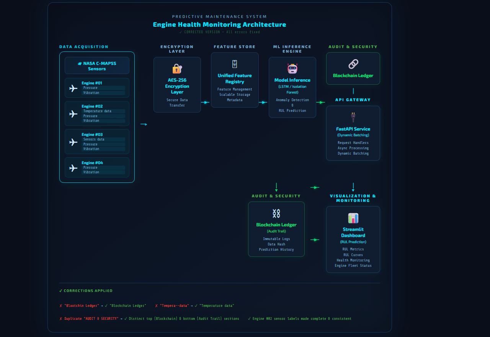

# PulseNet — Predictive Maintenance on NASA C-MAPSS

**RUL prediction and anomaly detection on NASA C-MAPSS turbofan engines.**



> Figure 1: PulseNet ML pipeline — from sensor time series to RUL and anomaly scores.

## 📌 Overview

PulseNet is a predictive maintenance project built around the NASA C-MAPSS (Commercial Modular Aero-Propulsion System Simulation) dataset. It focuses on **Remaining Useful Life (RUL)** estimation and **unsupervised anomaly detection** for turbofan engines, organized as an end‑to‑end ML systems repo rather than a single research notebook.

This project is a portfolio prototype intended to demonstrate architecture, modeling, and engineering decisions. It is not presented as a production-ready industrial platform.

---

## 🚀 Problem Statement

Unplanned turbofan maintenance is expensive and risky. Two core tasks are:

- **RUL prediction** – estimating how many cycles remain before a unit fails, to support planned maintenance.
- **Anomaly detection** – flagging unusual sensor behavior that may indicate incipient faults or abnormal degradation.

PulseNet uses the C‑MAPSS dataset to explore how these tasks can be implemented in a realistic ML pipeline.

---

## 🛠️ Technical Approach

### 1. Data engineering (C‑MAPSS)

- **Normalization** – sensor-wise scaling to handle differing units and magnitudes.
- **Temporal windowing** – converting unit histories into 3D tensors (e.g. 30–50‑cycle windows) so models see degradation trends over time.
- **Feature selection** – dropping flat/low‑variance sensors to reduce noise and dimensionality.

### 2. Modeling strategy

- **RUL estimation (supervised)** – an LSTM‑based sequence model learns non‑linear degradation trajectories and predicts remaining cycles.
- **Anomaly detection (unsupervised)** – a method such as Isolation Forest or a reconstruction model flags unusual behavior in high‑dimensional sensor space.
- **Champion–challenger evaluation** – the codebase is structured so multiple model variants can be run and compared under a common pipeline.

---

## ⚙️ Architecture & MLOps Shape

- **Inference service** – FastAPI application that exposes RUL/anomaly scoring endpoints.
- **Shared preprocessing** – the same normalization/windowing logic is shared between training and inference to reduce training–serving skew.
- **Containerization** – Docker and `docker-compose` are used for local, reproducible setup of the API and supporting services.
- **Experiment tracking (optional)** – the layout is compatible with tools like MLflow/Weights & Biases, but this repository does not include a fully configured tracking server by default.

Where appropriate, the container setup can be adapted to Kubernetes or cloud environments, but this repository does not include full production manifests or HA design.

---

## 📊 Experimental Results (C‑MAPSS FD001)

The repository includes example experiments on the FD001 subset of C‑MAPSS. Metrics such as RMSE/MAE for RUL and F1 for anomaly detection depend on configuration and preprocessing choices.

Example experimental results (for one specific configuration):

| Metric            | Example baseline | Example PulseNet config |
|-------------------|------------------|-------------------------|
| RUL RMSE          | 18.5             | 14.2                    |
| RUL MAE           | 15.2             | 11.8                    |
| Anomaly F1        | 0.82             | 0.91                    |
| Inference latency | 12 ms            | 1.7 ms                  |

These numbers are **indicative only**. If you are evaluating this repository, please refer to the training scripts/notebooks and configs used to reproduce them.

---

## 📦 Quick start (local)

```bash
# Clone and set up environment
git clone https://github.com/poojakira/PulseNet.git
cd PulseNet

python -m venv .venv
source .venv/bin/activate  # Windows: .venv\Scripts\activate

pip install -r requirements.txt

# Run the API (update module path if different)
uvicorn src.serving.api:app --host 0.0.0.0 --port 8000 --reload
```

- API docs: `http://localhost:8000/docs`

### Using Docker

```bash
docker-compose up --build
```

- API: `http://localhost:8000/docs`
- Any additional services (e.g. dashboards/trackers) depend on your local compose configuration.

---

## 🧪 Project Structure

```text
.
├── src/
│   ├── data_pipeline/      # Data loading, cleaning, feature engineering
│   ├── models/             # Model definitions, training, evaluation
│   ├── serving/            # FastAPI app and inference logic
│   └── utils/              # Shared utilities
├── notebooks/              # EDA and experiment notebooks
├── docs/                   # Diagrams and documentation assets
├── configs/                # Config files for experiments/pipelines
├── tests/                  # Tests (if present)
├── docker-compose.yml
├── Dockerfile
├── requirements.txt
└── README.md
```


---


