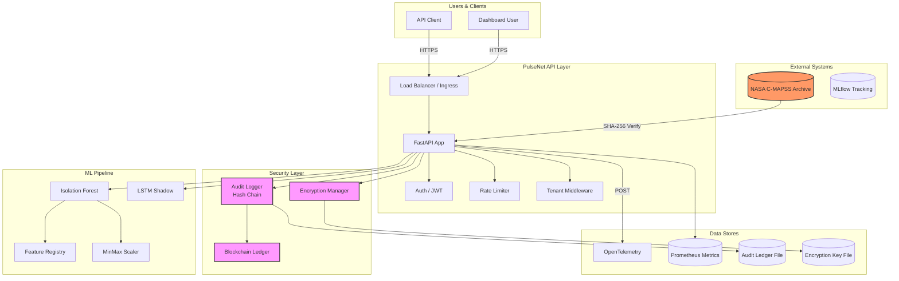
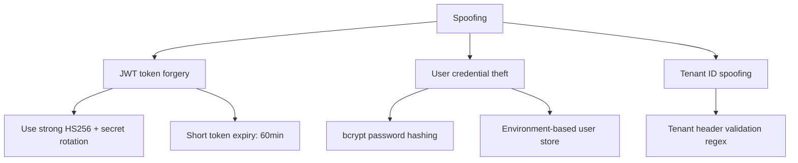
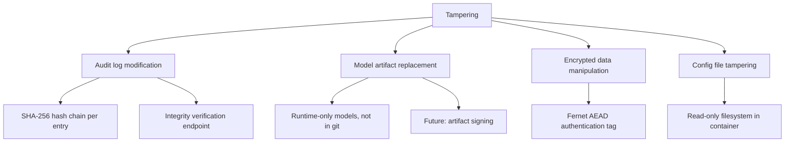
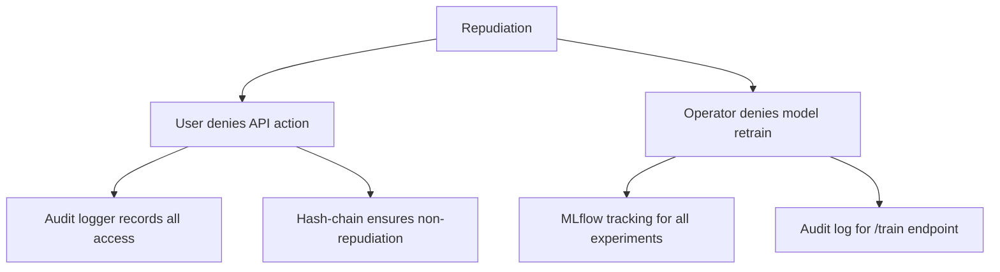
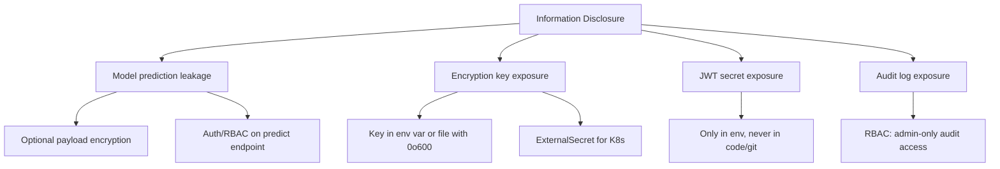
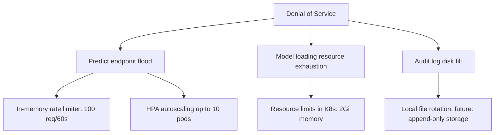
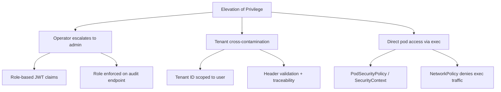

# PulseNet Threat Model

## Data Flow Diagram

## Assets

| Asset | Criticality | Description |
|-------|-------------|-------------|
| NASA FD001 archive | High | Official C-MAPSS telemetry — source of truth |
| Model artifacts | High | Trained IsolationForest, scaler, feature registry |
| JWT signing secret | Critical | Token integrity for all API auth |
| User password hashes | Critical | bcrypt hashes stored in env |
| Encryption key | Critical | AES-256 Fernet key for data-at-rest |
| Audit log ledger | High | Tamper-evident hash-chain of all access |
| Prediction endpoint | High | Availability and correctness of /api/v1/predict |

## Trust Boundaries

1. **Official data boundary** — Only `data.nasa.gov` archive content trusted after SHA-256 verification
2. **API boundary** — FastAPI receives untrusted client payloads and tenant headers
3. **Auth boundary** — JWT claims trusted only after signature verification
4. **Runtime boundary** — Model, scaler, key files are local runtime artifacts (not source-controlled)
5. **Container boundary** — Container images run as non-root with read-only filesystem

---

## STRIDE Threat Analysis

### Spoofing

| Threat | DREAD Score | Mitigation | Verification |
|--------|-------------|------------|--------------|
| JWT token forgery | 8 (9,9,8,7,7) | HS256 with env-based secret, 60min expiry | test_api.py validates token verify |
| Credential brute force | 6 (7,7,6,5,5) | bcrypt hashing, env-based user store | test_auth invalid login returns 401 |
| Tenant ID spoofing | 5 (6,5,5,4,5) | Regex validation `[A-Za-z0-9_.-]{1,64}` | test_tenant_header_rejected returns 400 |

### Tampering

| Threat | DREAD Score | Mitigation | Verification |
|--------|-------------|------------|--------------|
| Audit log tampering | 9 (9,9,9,9,9) | Hash-chain ledger with SHA-256 | test_audit_logger::test_verify_integrity |
| Model replacement | 7 (8,7,7,6,7) | Models not in git, loaded at runtime | Runtime load from models/ directory |
| Encrypted data tampering | 8 (9,8,8,7,8) | Fernet AEAD authentication | test_encrypt_decrypt_roundtrip |
| Config tampering | 5 (6,5,5,4,5) | ReadOnlyRootFilesystem in K8s | K8s securityContext enforcement |

### Repudiation

| Threat | DREAD Score | Mitigation | Verification |
|--------|-------------|------------|--------------|
| User denies API action | 7 (8,7,7,6,7) | AuditLogger with hash-chain integrity | test_audit_logger::test_log_access |
| Operator denies retrain | 6 (7,6,6,5,6) | MLflow experiment tracking + audit | MLflow run_id in audit metadata |

### Information Disclosure

| Threat | DREAD Score | Mitigation | Verification |
|--------|-------------|------------|--------------|
| Prediction leakage | 6 (7,6,6,5,6) | Encryptable payloads, RBAC enforced | test_predict_no_auth returns 401 |
| Key exposure | 9 (10,9,9,8,9) | K8s ExternalSecrets, .gitignore | .dockerignore excludes .runtime/ |
| JWT secret exposure | 9 (10,9,9,8,9) | Env-based, not in source control | .env.example has placeholder only |
| Audit log exposure | 5 (6,5,5,4,5) | Admin-only RBAC on /audit | test_audit_requires_auth |

### Denial of Service

| Threat | DREAD Score | Mitigation | Verification |
|--------|-------------|------------|--------------|
| Predict flood | 7 (8,7,7,6,7) | Rate limiter + HPA | test_rate_limit returns 429 |
| Resource exhaustion | 6 (7,6,6,5,6) | K8s resource limits (2Gi, 2 CPU) | K8s deployment manifest |
| Disk fill (audit) | 5 (6,5,5,4,5) | Future: append-only object storage | N/A (planned) |

### Elevation of Privilege

| Threat | DREAD Score | Mitigation | Verification |
|--------|-------------|------------|--------------|
| Operator to admin | 8 (9,8,8,7,8) | JWT role claim, RBAC on admin endpoints | test_audit_rbac returns 403 |
| Tenant cross-contamination | 6 (7,6,6,5,6) | Tenant header validation + reflection | test_tenant_header_is_reflected |
| Pod exec escalation | 7 (8,7,7,6,7) | SecurityContext: drop all caps, non-root | K8s securityContext in deployment |

---

## DREAD Scoring Guide

Each threat is rated 1-10 on five dimensions:

| Letter | Dimension | Description |
|--------|-----------|-------------|
| **D** | Damage Potential | How severe is the damage? |
| **R** | Reproducibility | How easy is it to reproduce? |
| **E** | Exploitability | How easy is it to exploit? |
| **A** | Affected Users | How many users are affected? |
| **D** | Discoverability | How easy is it to discover? |

Overall score = (D + R + E + A + D) / 5

---

## Mitigation Verification Matrix

| Threat | Mitigation | Tested | Test Name | K8s Enforced |
|--------|------------|--------|-----------|--------------|
| JWT forgery | HS256 + secret rotation | ✓ | test_auth | N/A |
| Invalid login | bcrypt + 401 response | ✓ | test_invalid_login | N/A |
| Tenant path traversal | Regex validation | ✓ | test_invalid_tenant_header_rejected | N/A |
| No auth predict | RBAC enforcement | ✓ | test_predict_no_auth | N/A |
| Operator audit access | RBAC admin-only | ✓ | test_audit_rbac | N/A |
| Audit tampering | Hash-chain ledger | ✓ | test_verify_integrity | N/A |
| Blockchain tampering | SHA-256 chain | ✓ | test_tamper_detection | N/A |
| Encryption roundtrip | Fernet AEAD | ✓ | test_encrypt_decrypt_roundtrip | N/A |
| Key rotation | Backup + new key | ✓ | test_key_rotation | N/A |
| Container escape | SecurityContext | N/A (integration) | N/A | ✓ |
| Network intrusion | NetworkPolicy | N/A (infra) | N/A | ✓ |
| Secret in git | .gitignore + .dockerignore | Manual | pre-commit check | ✓ ExternalSecret |

---

## Residual Risk

| Risk | Impact | Notes |
|------|--------|-------|
| Rate limiting is in-memory per-process | DoS across multiple pods | Move to Redis or Envoy for distributed rate limiting |
| Audit storage is local file | Disk fill, single point of failure | Migrate to append-only object store (S3) with retention policy |
| Model artifacts unsigned | Supply chain tampering | Add cosign/sigstore artifact signing in CI/CD |
| FD001 is public benchmark | Not representative of production | Replace with live telemetry for production deployment |
| No WAF in front of API | Web application attacks | Deploy AWS WAF or CloudFront with AWS WAF |
